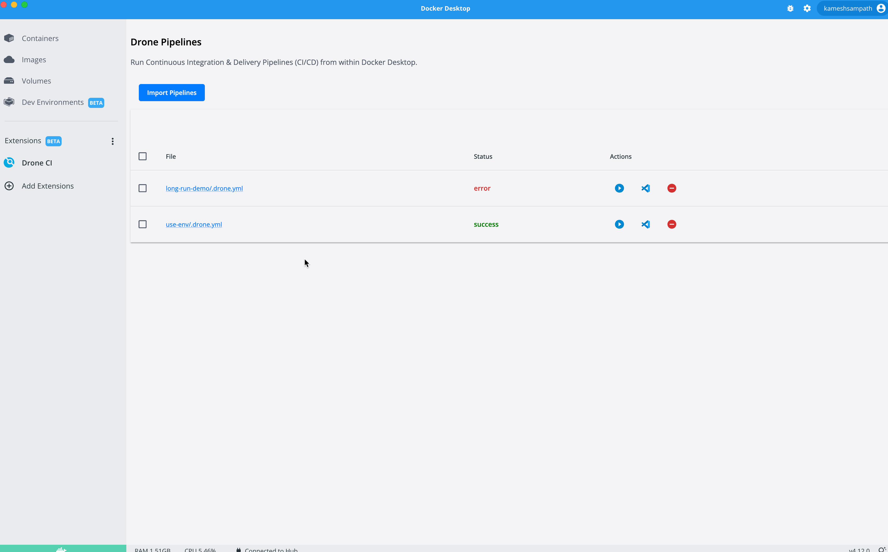
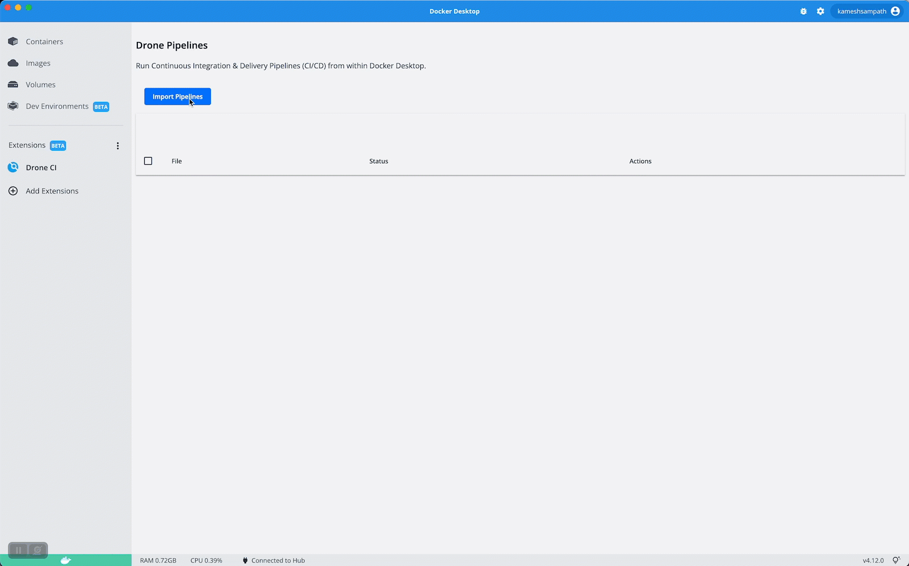

👋 Introduction
===============

Drone CI Extension
------------------

__TODO__: Update

Until now we saw how to execute the pipelines from command line. Drone Desktop is a [Docker Desktop Extension](https://docs.docker.com/desktop/extensions/) that allows you import and run pipelines from within Docker Desktop.

Install Drone Desktop Extension
-------------------------------

```shell
docker extension install docker.io/drone/drone-ci-docker-extension
```

If your install is successful you should see the **Drone CI** extension in the Docker Desktop as shown,



Import Pipelines
----------------

You can search and import pipelines into Drone Desktop,



Execute Pipeline
----------------

{== TODO: Update this section once we have the feature added to Drone Desktop ==}

🏁 Finish
=========

To complete this challenge, press **Check**.
