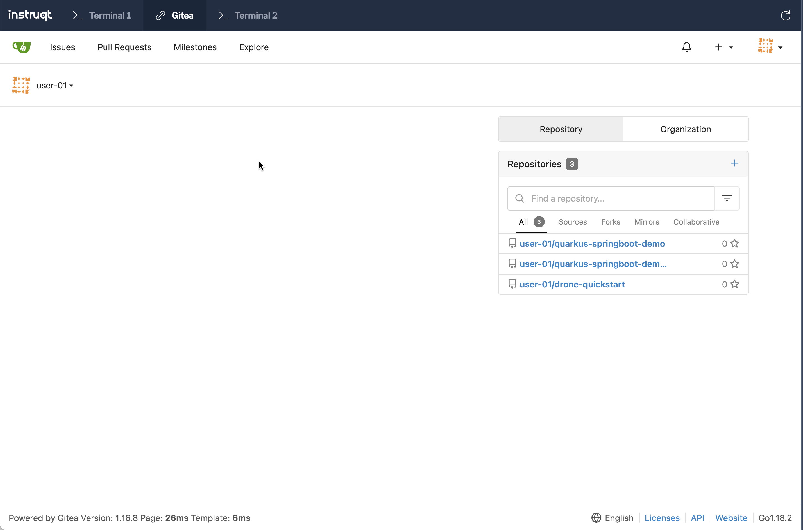

👋 Introduction
===============

Our first step in our CI journey is to find a place to host our Git repositories. In this track we will use Gitea, since we can run it locally in the Kubernetes cluster and customize it as needed.

🔧 Install Gitea
================

Add Gitea helm charts

```shell
helm repo add gitea-charts https://dl.gitea.io/charts/
helm repo update
```

Use the helm to deploy Gitea

```shell
envsubst < "$TUTORIAL_HOME/helm_vars/gitea/values.yaml" | helm upgrade \
  --install gitea gitea-charts/gitea \
  --values - \
  --wait
```

👤 Add Gitea User
=================

For all the challenges we will be using the Gitea user `user-01`. The user by default will be configured with the following repositories:

- <https://github.com/harness-apps/dag-stack>
- <https://github.com/harness-apps/dag-setup-verifier>
- <https://github.com/harness-apps/quarkus-springboot-demo>
- <https://github.com/harness-apps/quarkus-springboot-demo-gitops>

Run the following command to create `user-01` and configure the user with the repositories listed above

```shell
kustomize build "$DAG_HOME/k8s/gitea-config" \
  | envsubst | kubectl apply -f -
```

Wait for the job to complete before proceeding further

```shell
kubectl wait --for=condition=complete --timeout=120s -n drone job/workshop-setup
```

Now you can login to Gitea using Gitea tab using the user `user-01` and password `user-01@123`,



✏️ Rename dag-stack repository remote
===========================

Your shell is currently in the `dag-stack` repository that was cloned from GitHub when this virtual machine was launched. To push changes to the copy of the repository in Gitea, the remote URL needs to be changed.

Rename the existing remote to be `upstream`

```shell
git remote rename origin upstream
```

Add new remote to called `origin` to with url set to `${GITEA_URL}/user-01/dag-stack.git`

```shell
git remote add origin "${GITEA_URL}/user-01/dag-stack.git"
```

Listing the git remotes,

```shell
git remote -v
```

<pre>origin  ${GITEA_URL}/user-01/dag-stack.git (fetch)
origin  ${GITEA_URL}/user-01/dag-stack.git (push)
upstream        https://github.com/harness-apps/dag-stack.git (fetch)
upstream        https://github.com/harness-apps/dag-stack.git (push)
</pre>

Push the current "${DAG_TARGET_VERSION}" branch to `origin`. Enter `user-01` for the username and `user-01@123` for the password (you should not be prompted again during this track).

```shell
git push origin "${DAG_TARGET_VERSION}"
```

🏁 Finish
=========

To complete this challenge, press **Check**.
