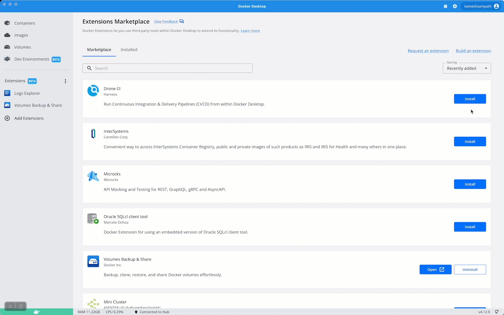
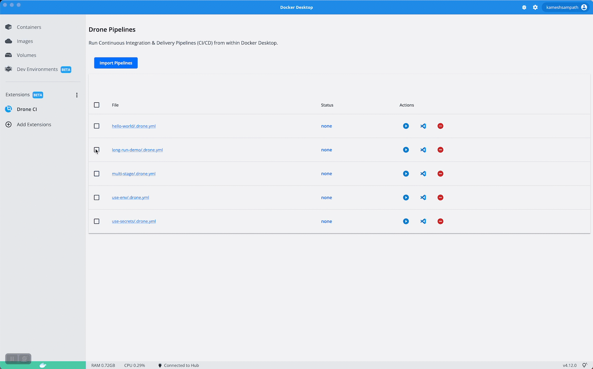

👋 Introduction
===============

Continuous Integration (CI) is a key element of cloud native application development. With containers forming the foundation of cloud-native architectures, developers need to integrate their version control system with a CI tool.

There’s a myth that continuous integration needs a cloud-based infrastructure. Even though CI makes sense for production releases, developers need to build and test the pipeline before they can share it with their team — or have the ability to perform the continuous integration (CI) on their laptop. Is that really possible today?

Pre-requisites
===============

* [Docker Desktop](https://www.docker.com/products/docker-desktop/)
* [Git](https://git-scm.org/)

Drone CI Extension
==================

Until now we saw how to execute the pipelines from command line. With [Drone CI Extension](https://hub.docker.com/extensions/drone/drone-ci-docker-extension) for [Drone Desktop](https://docs.docker.com/desktop/extensions/) is a Docker Desktop Extension that allows you import and run pipelines from within Docker Desktop.

Install Drone CI Extension
==========================

You can install the Drone CI extension right from the Docker Desktop as shown,



Import Pipelines
================

A CI Pipeline is an end-to-end integration workflow that pulls a codebase, builds an artifact, and then uploads the artifact to storage or a registry such as Docker Hub.The Pipeline will build and run a unit test on a codebase, upload the artifact to Docker Hub, and then run integration tests.

In order to import the existing pipeline, you can click the “Import Pipelines” option and choose the base directory to search drone pipelines. Ideally, these are project source folders that contain a `.drone.yml` file.

You can get started using the [examples](https://github.com/harness-apps/drone-ci-101-examples)

Clone the examples project locally,

```shell
git clone https://github.com/harness-apps/drone-ci-101
```

Using the **Import Pipelines** from the Extension Dashboard import all the example projects.

[Imported Projects](../assets/imported_examples.png)

Editing Project using Visual Studio Code
========================================

Visual Studio Code is a lightweight but powerful source code editor which runs on your desktop. It comes with built-in support for JavaScript, TypeScript and Node.js and has a rich ecosystem of extensions for other languages and runtimes (such as C++, C#, Java, Python, PHP, Go, .NET).It's easy to open your Drone Pipeline project in Visual Studio Code directly from the extension within Docker Desktop.

Click the **vscode** icon on the project you want to edit to edit the project using Visual Studio Code.

> **WARNING:**: This option works only if you have Visual Studio Code already installed.

Running Pipelines
==================

The extension allows you to run pipelines that have been imported using the "Import Pipelines".

Drone provides various options to execute the pipelines, in the following section we will explore few possible ways,

Running all steps
==================

By default the pipeline will execute all the steps, click the **play** button against the pipeline you want to run.

Run Steps in Trusted mode
=========================

Sometimes, you might be required to run a CI pipeline with elevated user privileges. Very similar to how you pass `--privileged=true` to `docker run` command, instead of passing the `--privileged` drone will pass that for each step container that gets created while running the pipelines.
Drone `trusted` mode is a way to inform the container runtime to run the pipeline containers with elevated privileges on the host machine.

Few examples of trusted mode are:

* Mounting Docker host socket onto the Pipeline container
* Mounting the Host path onto the Docker container.

Try running the projects `go-hello-world` or `java-hello-world` without checking the **Trusted** option in the run dialog. You will notice the run fails with an error _linter: untrusted repositories cant mount host volumes _. The error occurred as a result of us mounting `/var/run/docker.sock` but not using **Trusted** option while running the pipeline.

Now try running the same pipeline with **Trusted** enabled to see it succeed.

Once the build is successful you can run the image using the command,

```shell
docker run -p 8080:8080 localhost:5001/example/hello-go
```

Then running the following command should return **Hello World**

```shell
curl localhost:8080/
```

Run Specific Steps
==================

Drone also provides options to run specific steps. Select the *run* from `greeting/.drone.yml`, on the run dialog for the *Select steps to run*  choose any step(s) that you want to run and click *Run*. You will notice that only the selected steps were run.

>**NOTE:** Currently the logs does not support UTF-8 encoding and hence you will see UTF-8 characters as scrambled.

Run Pipelines with Environment File
===================================

Many times you may want to pass some environment variables to the build. Drone `exec` supports passing environment variables as files.Select the *run* from `env-greeting/.drone.yml` and for the option *Any environment file to be used with the pipeline ?* browse and select the `my-env` file form the project folder and click *Run* the pipeline which will use the environment variables from the `my-env` file. On a successful run the pipeline logs should display **Hello World** which is passed to the pipeline execution using environment file.

Run Pipelines with Secret File
==============================

Similar to environment file, you may also pass *secrets* to the build. Select the *run* from `using-secrets/.drone.yml` and for the option *Any secret file to be used with the pipeline ?* browse and select the `secret.txt` file form the project folder and click *Run* the pipeline which will use the secrets from the `secret.txt` file. On a successful run the pipeline logs should display today's timestamp by executing the SQL query `SELECT now() as today`. The postgresql connection parameters are passed using the `secrets.txt.

>**NOTE:** The secret values are masked when printed using logs

Remove Pipelines
================

You can remove one or more Drone pipelines, removing does not physically delete but the pipeline is ignored by the extension watchers.



🏁 Finish
=========

To complete this challenge, press **Check**.
