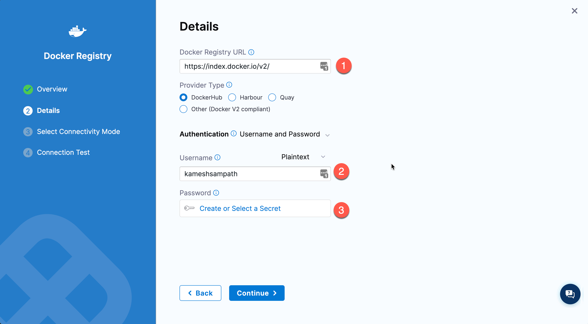
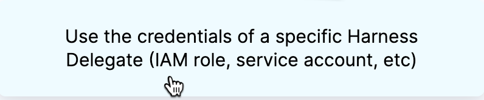
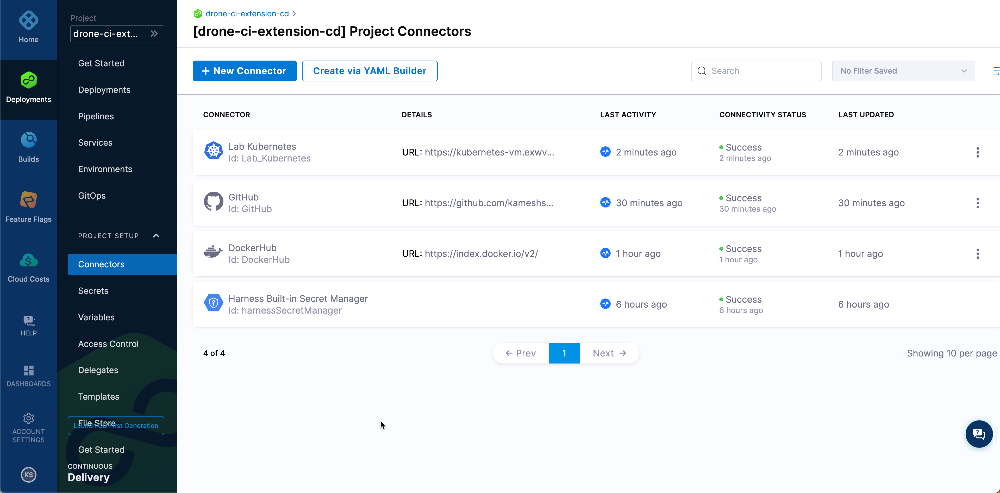

👋 Introduction
===============

__TODO__: Needs update

Eliminate scripting and manual deployments with declarative GitOps and powerful, easy-to-use pipelines. Empower your teams to deliver new features, faster – with AI/ML for automated canary and blue/green deployments, advanced verification, and intelligent rollback. Check all the boxes with enterprise-grade security, governance, and granular control powered by the Open Policy Agent.

Pre-Requisites
===============

Before we get started with the exercises of this chapter, you need to have the following,

- A GitHub Account and  [Personal Access Token](https://docs.github.com/en/authentication/keeping-your-account-and-data-secure/creating-a-personal-access-token) with __repo__ access enabled.
- An account with [Docker Hub](https://hub.docker.com) or [Quay.io](https://quay.io).
- Forked the project <https://github.com/harness-apps/drone-ci-harness-cd-demo> under your GitHub account.

Create Docker Repository
========================

As part of the upcoming exercises you will be building and pushing the image to a Docker Registry.

On the lab __Terminal__ navigate to `$TUTORIAL_HOME`,

```shell
cd $TUTORIAL_HOME
```

Edit the "$TUTORIAL_HOME/.envrc" using the __Editor__ tab and add the following environment variable,

```shell
# your container image registry username
export IMAGE_REGISTRY_USERNAME=
# your container image registry user password
export IMAGE_REGISTRY_PASSWORD=
# image registry where we will push the image e.g ghcr.io
export IMAGE_REGISTRY=
# image repo where we will push the image e.g "$IMAGE_REGISTRY/$IMAGE_REGISTRY_USERNAME/drone-ci-cd-hello-world"
export IMAGE_REPO=
```

Reload the environment variables to that the updated values are loaded.

```shell
direnv allow .
```

Create and push a dummy image to the Docker repository,

```shell
docker pull gcr.io/google-samples/hello-app:1.0
docker tag gcr.io/google-samples/hello-app:1.0 "$IMAGE_REPO:latest"
echo -n "${IMAGE_REGISTRY_PASSWORD}" | docker login "$IMAGE_REGISTRY" -u $IMAGE_REGISTRY_USERNAME --password-stdin
docker push "$IMAGE_REPO:latest"
```

>__IMPORTANT:__
>
> - It is OK to push dummy image now as we will be pushing an updated image as part of the CI pipeline in upcoming sections
> - Most of the container registries make the repositories private by default, make sure you mark them as public

Register with Harness
=====================

__TODO__: Needs update

Harness provides __Free Tier__ with all its platforms that can be used to perform PoCs, tests etc.,

Let us get started by registering for a free account, click the Harness CD tab to get an account created for yourself.

Create Project
==============

On your Harness CD account navigate to `Home --> Projects` and click "Create Project" to create a new [project](https://docs.harness.io/article/hv2758ro4e#organizations_and_projects).


You can give any name you want, but rest of the instructions we will refer to the project as `drone-ci-extension-cd`.  Click "Save and Continue" to leave the next screen to defaults.


On the __Harness Modules__ screen choose "Continuous Delivery" and "Start Free Plan".


__NOTE:__ Click `x` to cancel pipeline creation as we will be creating one as part of the upcoming sections.

If all went well we should land on the __Deployments__ dashboard,


🔧 Install Harness Delegate
===========================

The Harness Delegate is a service you run in your local network or VPC to connect all of your artifact, infrastructure, collaboration, verification and other providers with the Harness Manager. You can read more about various types of Delegates that Harness supports [here](https://docs.harness.io/article/h9tkwmkrm7-delegate-installation).

Navigate to `__Project Setup__ --> __Delegate__`,


Click the __Create Delegate__ to create a new delegate. On the delegate type screen choose __Kubernetes__ and click __Continue__.


Give a name to the delegate like __my-harness-delegate__, select the delegate size to be __Small__ and installer type to be __Kubernetes__. Leave rest to defaults and click __Continue__.


On the next screen click the __Copy to Clipboard__ to copy the Kubernetes manifest to clipboard.

Go to the Editor tab and create new file called `harness-delegate.yml` and paste the copied content on to the file. Click __Save__ to save the file.

>__TIP:__ You can also save the delegate locally and apply it any number of times in case you create new clusters.

Get back to the Harness Window and click __Continue__ to finish the wizard.

On the __Terminal__ run the following command,

```shell
kubectl apply -f "$TUTORIAL_HOME/harness-delegate.yml"
```

Wait for the harness delegate statefulset __my-harness-delegate__ to be up and running,

```shell
kubectl rollout status -n harness-delegate-ng  statefulset my-harness-delegate --timeout=180s
```

> __NOTE__: It will take few minutes the delegate to be ready and connected to your Harness Account.

If all went well and successful you should the delegate ready on your Harness account,


㊙️ Secrets
==========

Harness includes built-in Secrets Management to store your encrypted secrets, such as access keys, and use them in your Harness account.  Harness integrates with all popular Secrets Managers. For more information check the [Secret Management](https://docs.harness.io/article/hv2758ro4e#secrets_management) online.

As part of the upcoming exercises you need to connect to Docker Hub, GitHub and Kubernetes Clusters. To connect to them transparently you need to save your Harness account with the respective credentials. For this challenge we will store the credentials as __Encrypted__ __Text__ secrets.

Before we go further into creation of secrets ensure you have the following details with you,

- Docker Registry Username and Password
- GitHub Personal Access Toke
- Kubeconfig of the lab cluster

Navigate to `__Project Setup__ --> __Secrets__`.

Docker Registry
---------------


Click on the  to start adding new secret,

Fill the details of the secret with name `my-dockerhub-password`, with Secret Value to be `$IMAGE_REGISTRY_PASSWORD` and click save to save the secret.


> __NOTE:__
>
> Though we can use encryption for usernames as well but for this challenge we will store the username(s) as plain text.

GitHub PAT
----------

As did with previous section click on the  to start adding new secret,

Fill the details of the secret with name `my-github-pat`, with Secret Value to be that of your GitHub PAT and click __Save__ to save the secret.


With this your project's __Secrets__ dashboard should look like,


🔌 Connectors
=============

Connectors contain the information necessary to integrate and work with 3rd party tools. Harness uses Connectors at Pipeline runtime to authenticate and perform operations with a 3rd party tool.

As part of this challenge we will configure the following three connectors,

- [Docker Registry Connector](https://docs.harness.io/article/u9bsd77g5a-docker-registry-connector-settings-reference) to make our pipelines listen to new image pushes.
- [GitHub Connector](https://docs.harness.io/article/jd77qvieuw-add-a-git-hub-connector) to pull Helm manifest sources to deploy the application to Kubernetes Cluster.
- [Kubernetes Connector](https://docs.harness.io/article/1gaud2efd4-add-a-kubernetes-cluster-connector) to connect to our lab Kubernetes cluster and deploy the Helm charts of the *hello world* application.

Navigate to `__Project Setup__ --> __Connectors__`.


Docker Registry Connector
-------------------------

Click on the  to start adding new Docker Registry Connector,

Select Docker Registry by navigating to `__Artifact Repositories__ --> __Docker Registry__`,


Give a name like `DockerHub` and click __Continue__,


On the __Details__ screen use the Docker Registry URL as `https://index.docker.io/v2/` add fill other details as shown,



For __Password__(__3__) click the `Create or Select Secret` and choose the `my-dockerhub-password` secret and click __Apply Selected__.


Click __Continue__ to move to next screen where you choose how to connect to the __Git__ provider let us choose __Connect Through Harness__ platform as we use public GitHub.


Click __Save and Continue__ to finish the connectivity test. If all our connection parameters are right then the connectivity test should succeed.


Click __Finish__ to complete the Docker Registry Connector creation.

GitHub Connector
----------------

Click on the  to start adding new GitHub Connector,

Select Docker Registry by navigating to `__Code Repositories__ --> __GitHub__`,


Give name to the connector say __GitHub__ and click __Continue__,


Provide the GitHub details such as your GitHub Account Name and Github test repository say `drone-ci-harness-cd-demo` and click __Continue__.


One the __Credentials__ screen provide your GitHub username. For the password select the __my-github-pat__ secret.


Click __Continue__ to move to next screen where you choose how to connect to the __Git__ provider let us choose __Connect Through Harness__ platform as we use public GitHub.


Click __Save and Continue__ to finish the connectivity test. If all our connection parameters are right then the connectivity test should succeed.


Click __Finish__ to complete the GitHub Connector creation.

Kubernetes Connector
-----------------------

Finally we need to add the __Kubernetes__ connector to allow the Harness CD pipelines to deploy to our lab Kubernetes Clusters.

Click on the  to start adding new __Kubernetes__ Connector,

Select Docker Registry by navigating to `__Cloud Providers__ --> __Kubernetes__`,


Give name to the connector say __Lab Kubernetes__ and click __Continue__,


As you have the Harness Delegate running the Lab Kubernetes Cluster, on the details screen select  option and click __Continue__,

On the next screen, use the option __Only use Delegates with all of the following tags__ and select the delegate __my-harness-delegate__ that we deployed earlier,



Click __Save and Continue__ to finish the connectivity test. If all our connection parameters are right then the connectivity test should succeed.


Click __Finish__ to complete the Kubernetes Connector creation.

If all went well we should see the following connectors on the __Connectors Dashboard__.



🏁 Finish
=========

To learn further with Harness CD, please visit our official documentation [page](https://docs.harness.io/category/pfzgb4tg05-howto-cd).

To complete this challenge, press __Check__.
