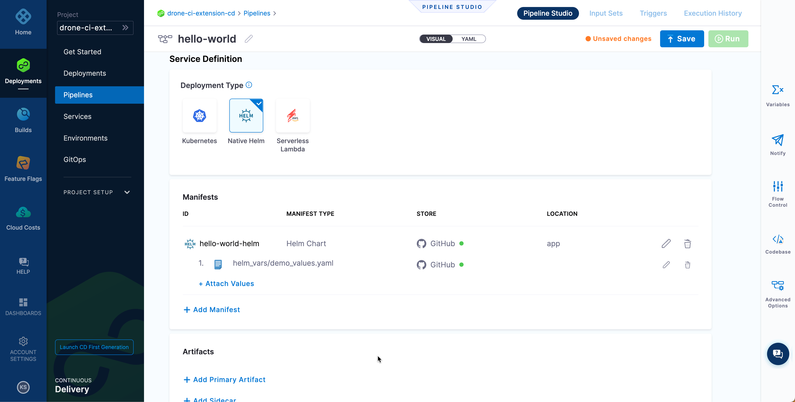

👋 Introduction
===============

__TODO__: Update

When it comes to cloud to achieve an efficient software delivery velocity we need the CI and CD to work in synchronization. Traditionally CI/CD has been mixed, that worked for traditional environment but when it comes to cloud we need to have them separated to achieve,

- Maintainability
- Resiliency
- Better Credentials Management
- Faster Deployment and Rollback

As part of this challenge let us create a CD Pipeline with your Harness Account that we configured as part of the earlier chapter to allow us to deploy an Container Image right from our laptops.

Pre-Requisites
===============

You should completed the earlier challenge as this challenge depends resources created earlier.


🔧 Create Pipeline
==================

Under the project __drone-ci-extension-cd__ project, navigate to `__Pipelines__`,

Click  to kick start the pipeline creation wizard.

Lets call the pipeline to be `hello-world` , select __Inline__ option and click __Start__ to start configuring the pipeline.


A Stage is a subset of a Pipeline that contains the logic to perform one major segment of the Pipeline process. For more details on Stage check the online [documentation](https://docs.harness.io/article/hv2758ro4e#stages).

Click __Add Stage__ to start adding a stage to the pipeline, choose __Deploy__ as the stage type,


Call the stage name to be __Deploy to Kubernetes__ and leave the rest to defaults.

>__NOTE__: With Free Tier you can only deploy __services__

Click __Set Up Stage__ to proceed further.


On __About the Service__, click `+New Service` to give a name to your service deployment say "Hello World" and click __Save__ to save the service.


Service Definition
------------------

As we will be using [Helm Charts](https://helm.sh) to deploy the service, on the __Service Definition__ choose the __Deployment Type__ to be `Native Helm`.


### Manifests ###

Click on the `+Add Manifest` to configure the manifest to use.

On the __Add Manifest__ wizard choose the __Manifest Type__ to be __Helm__ and click continue.


On the __Manifest Source__ page choose the manifest source to be __Github__ and select the GitHub connector that we configured in the earlier challenge. Click __Continue__ to proceed further,


On the manifest details page,

- Give any name for the field __Manifest Name__, for the reference let us call it as `hello-world-helm`.
- For the __Repository Name__ point to your Github __fork__. Just provide the repo name as full URL is derived from the __GitHub__ connector.
- Set the __Branch__ name to `main` or what ever branch you have it as default in your __fork__
- Set the __Chart Path__ to be `app`
- Set the __Helm Version__ to be `Version 3`
- For __Values.yaml__ click the `+Add File` and add the path `helm_vars/demo_values.yaml` to it.


Click __Submit__ complete adding the __Manifest__.



### Artifacts ###

As we wish the CD pipeline to be triggered on new container image being pushed our container registry(Docker Hub), we need our container image configured as the primary artifact,

Under the __Artifacts__ section click `+Add Primary Artifact` to start adding our container image artifact,

Select the __Artifact Repository Type__ to be __Docker Registry__ and click __Continue__ to continue further,


On the __Docker Registry Repository__ choose the __DockerHub__ docker registry connector that we created earlier. Click __Continue__ to proceed further.


On the __Artifact Details__ enter your Docker Hub repository where you will be pushing the container image.


Leaving rest to defaults click __Submit__ to complete the __Primary Artifact__ configuration.


Click __Continue__ to configure the __Infrastructure__.

### Infrastructure ###

On the __Environment__ click `+New Environment` to add a new environment, let us call it as `Dev` and choose `Pre-Production` as __Environment Type__ and click __Save__ to complete the wizard.


One the __Infrastructure Definition__ select __Kubernetes__ under the __Direct Connection__.


On the __Cluster Details__ choose the __Lab Kubernetes__ as connector that we configured earlier challenge, set the __Namespace__ where we want to deploy the resources and click the __Advanced__  section to give name to the Helm release.


Click __Continue__ to proceed further defining __Execution__.

### Execution ###

Let us choose __Rolling__ as the __Execution Strategy__ and click __Use Strategy__ to complete the __Execution Strategy__ wizard.


Click __Save__ to save the CD pipeline.


🔥 Add Trigger
==============

[Triggers](https://docs.harness.io/article/c1eskrgngf-trigger-on-a-new-artifact) allow the CD pipeline to started on certain events. In this challenge we will learn how to create a trigger that will start pipeline whenever a new image(__Primary Artifact__) is pushed to DockerHub registry.

Navigate to` __Project__` --> `__Pipelines__` --> `__hello-world` --> `Triggers`,


Click __Add Trigger__ to add a new trigger.


Select __Artifact__ and choose __Docker Registry__ as the artifact.


Give a name to the Trigger say `hello-world-from-dockerhub` and configure it to listen to the pipeline's primary artifact by clicking `+Select Artifact`.


Click __Continue__ on the next two screens leaving others to defaults.


🔧 Run CI Pipeline
==================

>__IMPORTANT__: The CI pipeline will be executed from your local laptops

On your local machine navigate to `$TUTORIAL_HOME` the folder where you have cloned the <https://github.com/harness-apps/drone-ci-101>

```shell
cd $TUTORIAL_HOME/java-hello-world
git checkout ci-cd
```

Reload the environment variables,

```shell
direnv allow .
```

If you have not imported the project on to Drone CI extension on Docker Desktop, import the project `java-hello-world`.

Before running the pipeline create a file called `secrets` with the following content,

<pre>
image_registry_username: &lt;your docker hub user name&gt;
image_registry_password: &lt;your docker hub password&gt;
</pre>

>__IMPORTANT:__ The `image_registry_username` and `image_registry_password` should be the same that was used when configuring Docker Registry Connector.

Create a file called `.env` with the following values,

<pre>
PLUGIN_REPO=&lt;your image repo&gt;
PLUGIN_TAG=0.0.1
</pre>

>__IMPORTANT:__ The `PLUGIN_REPO` should be the same repository that you had configured in Harness CD as the  __Primary Artifact__'s __LOCATION__ value.
>
> 

Run the Drone CI pipeline from Drone CI extension with following configuration,


Once the image is pushed to your Docker Hub registry, you should see the CD pipeline getting triggered.

>__IMPORTANT:__ The CD Pipeline does polling of the registry every `2 mins` i.e. the CD does not kick in immediately after the image is pushed.

🔧 Verify Deployment
====================

Wait for the pipeline to be complete,


>__NOTE:__ The screen shot above shows multiple executions but in your case you will have only one execution.

Once the pipeline is successful, verify your deployment by running the following command on lab __Terminal__,

```shell
export NODE_PORT=$(kubectl get --namespace default -o jsonpath="{.spec.ports[0].nodePort}" services hello-world)
http localhost:$NODE_PORT/hello-world
```

The command should show the following output,

```text
HTTP/1.1 200
Connection: keep-alive
Content-Type: application/json
Date: Wed, 19 Oct 2022 05:30:43 GMT
Keep-Alive: timeout=60
Transfer-Encoding: chunked

{
    "content": "Hello, Stranger!",
    "id": 1
}
```

Any new update top the sources and running CI should now trigger a new deployment to the Kubernetes Cluster via Harness CD Pipeline.

🏁 Finish
=========

To learn further with Harness CD, please visit our official documentation [page](https://docs.harness.io/category/pfzgb4tg05-howto-cd).

To complete this challenge, press __Check__.
