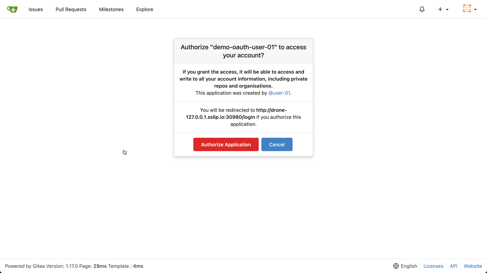
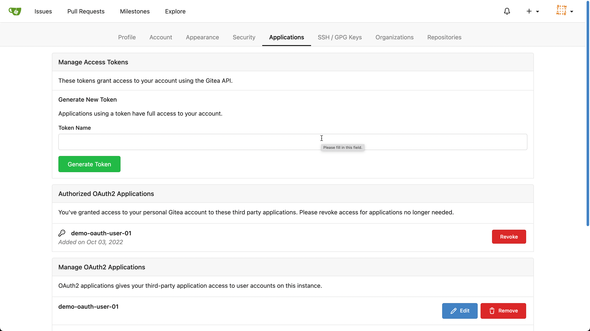

👋 Introduction
===============

Our next step in our CI journey is to find right CI tool that can understand Container Native paradigms, making Cloud Native Application deployments simpler, faster and easier. Once such CI tools is [Drone CI](https://drone.io).

🔧 Install Drone
================

Add Drone helm charts

```shell
helm repo add drone https://charts.drone.io
helm repo update
```

Get the Gitea HTTP Service Cluster IP,

```shell
export GITEA_HTTP_CLUSTER_IP=$(kubectl get -n default svc gitea-http -ojsonpath='{.spec.clusterIP}')
```

Use the helm to deploy drone

```shell
envsubst < "$TUTORIAL_HOME/helm_vars/drone/values.yaml" | helm upgrade \
  --install drone drone/drone \
  --namespace drone \
  --values - \
  --wait
```

👤 Login to Drone
=================

Open the Drone CI Dashboard but opening the url `${DRONE_SERVER_URL}` on your browser.

When prompted to authorize as shown, **Authorize Application** the oAuth application that got created as part of Git(Gitea) setup.



You can check the registered oAuth applications via Git Application settings screen,



> **NOTE:**
> Drone shares the same credentials `user-01` and password `user-01@123` as it is connected to Git(Gitea) using oAuth

🔧 Install Drone Runner
======================

Drone runners poll the server for workloads to execute. There are different types of runners optimized for different use cases and runtime environments. AS part of this tutorial we will use [Drone Docker Runner](https://docs.drone.io/runner/docker/overview/).

Kubernetes nameserver
---------------------

Since NXRM is running inside the Kubernetes cluster behind a service, the Kubernetes nameserver needs to be passed to the Drone Docker plugin when building the container.

Retrieve the `/etc/resolv.conf` file from a temporary pod by running this command:

```shell
kubectl run -i --tty busybox --image=busybox --restart=Never -- cat /etc/resolv.conf
```

You should see output similar to this:

<pre>
search default.svc.cluster.local svc.cluster.local cluster.local pguvupthd4vq.svc.cluster.local c.instruqt-prod.internal google.internal
nameserver 10.43.0.10
options ndots:5
</pre>

Here, `10.43.0.10` is the nameserver.

Network MTU
-----------

Depending on how your Kubernetes cluster in the VM has been configured, the MTU (Maximum Transmission Unit) might be different. When creating temporary Docker networks in Kubernetes pods (which we are about to do when we build our container), this value must be the same as or smaller than the host.

Retrieve the MTU value with this command

```shell
ifconfig | grep cni
```

The command should show an output like:

<pre>cni0: flags=4163<UP,BROADCAST,RUNNING,MULTICAST>  mtu 1410
</pre>

Update the environment variable `DOCKER_CNI0_MTU` value as per the `mtu` value shown in the output of the command.

> **TIP:**
> The values could be easily overridden using `.envrc.local`.

Let us use helm to deploy `drone-runner-docker`,

```shell
envsubst < "$TUTORIAL_HOME/helm_vars/drone/docker-runner-values.yaml" | helm upgrade \
  --install drone-runner-docker drone/drone-runner-docker \
  --namespace drone \
  --values - \
  --wait
```

✅ Validate Drone Setup
=======================

What we have done until now,

- Setup Gitea
- Setup Drone Server
- Setup Drone Docker Runner

Drone Account Settings
----------------------

Click on the little avatar on the *Drone Dashboard* to view the user account settings. We will be using the values `DRONE_SERVER` and `DRONE_TOKEN` from this page in upcoming sections of the tutorial.

[Drone User Account Settings](./../assets/drone_account_settings.png)

Add Drone Admin User
--------------------

Copy the values,

```shell
export DRONE_SERVER="drone server as listed in the drone account settings page"
export DRONE_TOKEN="token from the drone account settings page"
```

Using the **Code** tab edit the `drone-ci-101` project and update the file named `.envrc.local` with the values of `DRONE_SERVER` and `DRONE_TOKEN` copied and exported from the account setting page.

>**NOTE:** The `DRONE_SERVER` and `DRONE_TOKEN` are already set in the `.envrc`, just make sure its synchronize your deployment.

Ensure to reload the updated environment variables,

```shell
direnv allow .
```

Run the drone command to verify we are able to use drone cli,

```shell
drone user ls
```

As the current user `user-01` is not an admin, the command above fails with `client error 403: {"message":"Forbidden"}` message. The current user need to be an admin user to be able to perform few administrative tasks as part of other challenges.

```shell
envsubst < "$TUTORIAL_HOME/helm_vars/drone/enable-admin-values.yaml" | helm upgrade \
  --install drone drone/drone \
  --namespace drone \
  --values - \
  --wait
```

Running `drone user ls` command again now be successful and listing the only user `user-01`.

```shell
drone user ls
```

You can also verify of the `user-01` is an admin or not by running the command,

```shell
drone info --format "Admin: {{ .Admin }}"
```

The command should show an output like,

<pre>Admin: true</pre>

🏁 Finish
=========

To complete this challenge, press **Check**.
